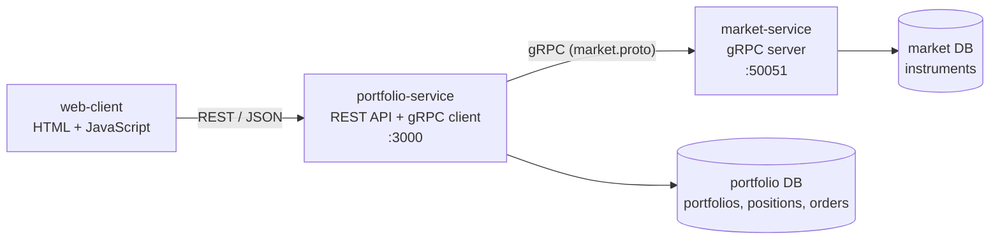

# Paper Trading

A small trading simulator: create a portfolio with virtual cash, buy and sell stocks at
the current market price, and follow the value and profit/loss of your positions.

**Authors:** Beya Lina Heni and Elsa Djaffar

**Repository:** https://github.com/beyaheni/PAPERTRADING

## Architecture



This is the architecture suggested in the subject:
`Client -> REST web service (RPC client) -> RPC server`, with one database per service.

| Service | Role | Exposes | Database |
|---|---|---|---|
| `portfolio-service` | Portfolios, orders, valuation. Owns the business rules. | REST on `:3000` | `portfolio.sqlite` |
| `market-service` | Reference data and prices of the instruments. | gRPC on `:50051` | `market.sqlite` |
| `web-client` | Optional browser client. | - | - |

The two services share nothing except the gRPC contract `proto/market.proto`.
`portfolio-service` never reads the market database: it asks `market-service` for a quote.

**What happens when a user buys 10 BNP** (`POST /portfolios/1/orders`):

1. `PortfolioController` receives and validates the request.
2. `PortfolioService` asks `MarketClient` for the price, which calls `GetQuote` on `market-service` through gRPC.
3. `market-service` reads the instrument in its own database and returns the quote.
4. `PortfolioService` checks the cash, then updates cash, position and order history in one database transaction.
5. The executed order is returned as JSON.

Stack: TypeScript, [NestJS](https://nestjs.com), TypeORM, SQLite, gRPC.

## Repository layout

One folder per service, each with its own `package.json`:

```
proto/market.proto            gRPC contract shared by both services
market-service/               gRPC server
  src/instrument/
    instrument.grpc.controller.ts   web layer (gRPC entry point)
    instrument.service.ts           service layer
    instrument.entity.ts            entity
portfolio-service/            REST API
  src/portfolio/
    portfolio.controller.ts         web layer (REST entry point)
    portfolio.service.ts            service layer (business rules)
    entities/                       entities: Portfolio, Position, Order
    dto/                            request / response objects
  src/market/
    market.client.ts                gRPC client of market-service
    market.controller.ts            GET /instruments
  src/common/
    global-exception.filter.ts      exception handler
    business.exceptions.ts          business errors
web-client/index.html         browser client
requests.http                 ready-to-run demo requests
```

## Best practices of the course

| Practice | How it is applied |
|---|---|
| Git: one folder per service | `market-service/`, `portfolio-service/`, `web-client/`. |
| Layers (web, services, entities) | Controllers only translate HTTP/gRPC; services hold the rules; entities map the tables. Same split in both services. |
| Inversion of Control | NestJS container: classes are marked `@Injectable()` and receive their dependencies through the constructor (the equivalent of `@Autowired` in Spring). Nothing is created with `new`. |
| Logger instead of console output | NestJS `Logger` in every class, with levels (`log`, `warn`, `error`). No `console.log`. |
| Exception handler for HTTP errors | `GlobalExceptionFilter` turns every error into one JSON format with the right status and a readable message, including errors coming back from gRPC. |
| Stateless web service | No session and nothing kept in memory between two requests: all state is in the databases, so any instance can answer any request. |

## REST API

Interactive documentation (Swagger): http://localhost:3000/docs

| Method | Path | Description |
|---|---|---|
| GET | `/instruments` | Tradable instruments and prices (via gRPC) |
| POST | `/portfolios` | Create a portfolio `{ owner, initialCash }` |
| GET | `/portfolios` | List portfolios |
| GET | `/portfolios/{id}` | One portfolio with its positions |
| DELETE | `/portfolios/{id}` | Delete a portfolio and its history |
| POST | `/portfolios/{id}/orders` | Buy or sell `{ symbol, side: BUY or SELL, quantity }` |
| GET | `/portfolios/{id}/orders` | Order history |
| GET | `/portfolios/{id}/valuation` | Value and profit/loss at current prices (via gRPC) |

Every error has the same shape:

```json
{
  "timestamp": "2026-10-05T00:08:34.675Z",
  "status": 422,
  "error": "UNPROCESSABLE_ENTITY",
  "message": "Insufficient funds: order costs 69820.00 but only 8748.70 is available",
  "path": "/portfolios/1/orders"
}
```

| Status | When |
|---|---|
| 400 | Invalid body or id |
| 404 | Unknown portfolio, or unknown symbol (gRPC `NOT_FOUND`) |
| 422 | Not enough cash to buy, or selling more than held |
| 503 | `market-service` is down (gRPC `UNAVAILABLE`) |
| 504 | `market-service` did not answer within 3 seconds |

## gRPC API

Defined in [`proto/market.proto`](proto/market.proto):

| RPC | Request | Response |
|---|---|---|
| `GetQuote` | `symbol` | `symbol, name, price, currency` |
| `ListInstruments` | - | list of quotes |

Prices move by a small random step (0.5 % at most) each time a quote is requested, to
simulate a live market and make the profit/loss change.

## Run it

Requires Node.js 22 or later (20.19+ also works). Open two terminals at the root of the repository.

```bash
# Terminal 1 - gRPC server
cd market-service
npm install
npm start
```

```bash
# Terminal 2 - REST API
cd portfolio-service
npm install
npm start
```

Then either:

- open `web-client/index.html` in a browser,
- or open http://localhost:3000/docs,
- or run the requests of `requests.http`.

The databases are created and filled on the first start, in the `data/` folder of each service.
Delete that folder to start again from scratch.

### Configuration (environment variables, all optional)

| Variable | Service | Default |
|---|---|---|
| `GRPC_URL` | market-service | `0.0.0.0:50051` |
| `PRICE_VOLATILITY` | market-service | `0.005` (use `0` for fixed prices) |
| `PORT` | portfolio-service | `3000` |
| `MARKET_GRPC_URL` | portfolio-service | `localhost:50051` |
| `DB_FILE` | both | `data/market.sqlite`, `data/portfolio.sqlite` |
